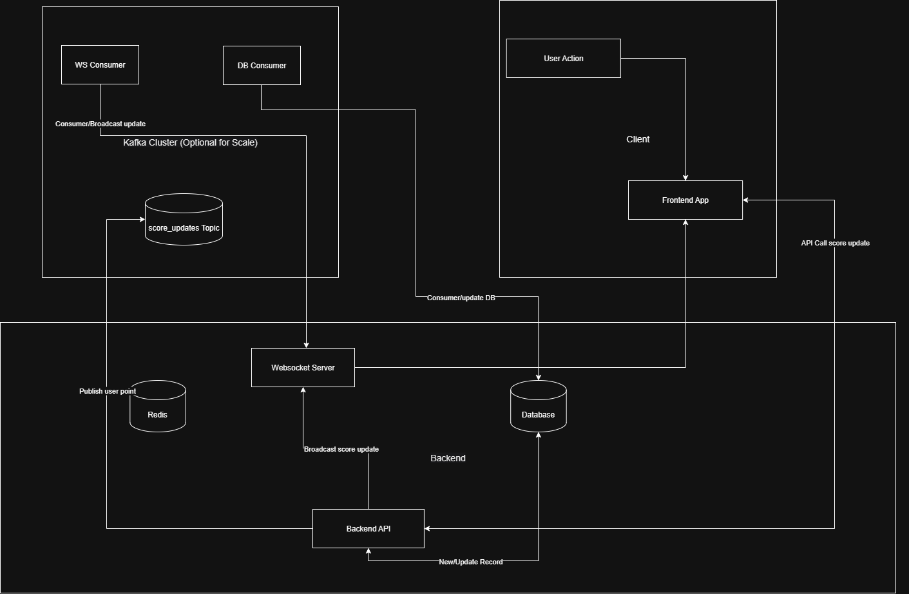

# Scoreboard API Module

## Overview

This module provides a backend API service for a real-time scoreboard. It handles secure score updates, leaderboard retrieval, and live updates for connected clients. The design emphasizes performance, scalability, and security.

## Requirements

1. Scoreboard Display

    - Provide an API to fetch the top 10 users with highest scores.

    - Must respond fast (use DB index, caching).

2. Score Update

    - User’s score increases after completing a specific action.

    - The frontend sends only actionId to backend; backend decides points (not client).

3. Live Updates

    - Clients receive real-time updates (WebSockets or SSE).

    - Broadcasts should be throttled or diff-only for performance.

4. Authentication

    - Secure score updates with JWT-based authentication.

    - Refresh flow included to avoid token abuse.

5. Performance Safeguards

    - Rate limiting on /score/update.

    - Redis caching for /score/top.

    - Optionally Kafka for high-scale event processing.

## API Endpoint
1. POST ```/api/score/update```

    Increment score for authenticated user after valid action.
    
    Auth Required: ✅ Yes

    Request

    ```json 
    { "event_name": "MISSION_COMPLETED" }
    ```
    Response
    ```json
    { "success": true, "newScore": 10 }
    ```

    Backend defines points per event in a secure server-side map:

    ```json
    {
        "MISSION_COMPLETED": 10,
        ...
    }

    ```
2. GET ```/api/score/top```

    Fetch the top 10 users.

    Response
    ```json
    [
        { "userId": "uuid", "username": "user_01", "score": 120 },
        ...
    ]

    ```
    
3. WS ```/score/subscribe```

    Subscribe to real-time scoreboard updates.

    Broadcast Payload
    ```json
    {
        "type": "SCOREBOARD_UPDATE",
        "data": [
            { "userId": "uuid", "username": "user_01", "score": 120 },
            ...
        ]
    }

    ```

## Execution Flow Diagram



## Suggested Improvements

- Leaderboard Queries

    -   Index on score DESC.

    - Cache leaderboard in Redis (refresh only on score changes).

- WebSocket Broadcasting

    - Send diff-only updates instead of full leaderboard.

    - Throttle broadcasts (e.g., max once/sec).

- Database Writes

    - Use atomic updates (UPDATE users SET score = score + X).

    - If high write load, switch to Kafka to buffer writes.

- Rate Limiting

    - Prevent spam with per-user rate limits (e.g., 5 updates/sec).

- Kafka (optional for scale)

    - Decouple API from DB writes + WS broadcasts.

    - Handle 100k+ updates/sec with partitions.

- Add audit logs for suspicious score patterns.

- Support multiple leaderboards (daily, weekly, all-time).

- Add Prometheus metrics (e.g., updates/sec, WS connections).